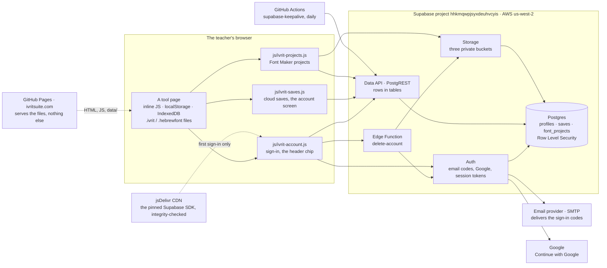
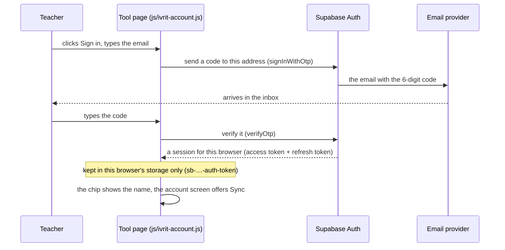
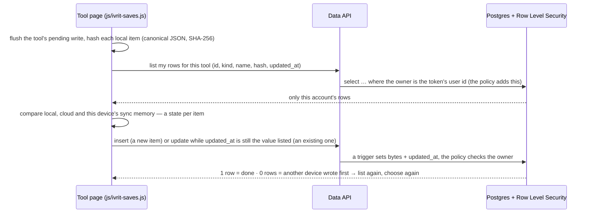
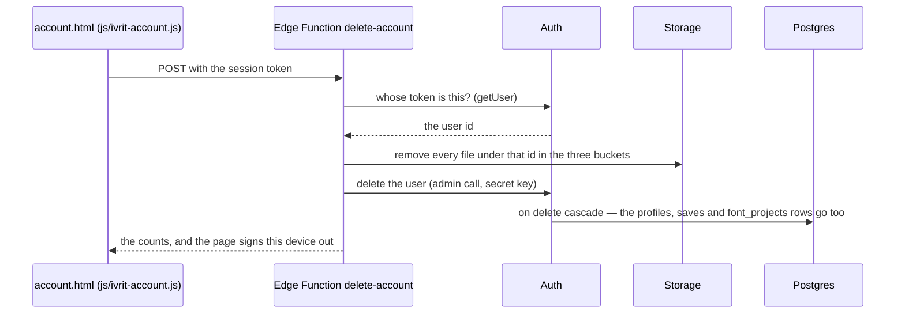

# IvritSuite backend — what talks to what

> A plain-language map of the account layer for a maintainer who is not a backend developer. The details
> live next door: the browser side in `docs/reference/accounts-and-cloud.md`, the database side in
> `db/README.md`, the day-to-day checklist in the README's *Keeping it running*, the binding rules in
> `CLAUDE.md`. This file describes the shape of the thing, so it carries no session ids, dates or digests.

## In one paragraph

IvritSuite is a set of static pages. **GitHub Pages** serves the files and does nothing else: there is no
server of ours, no build step, no framework. Every tool does its work in the browser and keeps its saves in
the browser (localStorage, IndexedDB) and in files the teacher downloads (`.ivrit`, `.hebrewfont`). The
optional account layer adds one outside service, **Supabase**, which is a hosted Postgres database with
three doors in front of it: **Auth** (who is signed in), the **Data API** (rows in tables, where the
database itself decides which rows a caller may see) and **Storage** (files). One small program of ours runs
on Supabase's servers, the **delete-account** Edge Function, because deleting an account needs a key that
must never reach a browser. A **GitHub Actions** job asks the database one tiny question a day so the free
project is never paused for inactivity. That is the whole backend.

## The picture

Dotted lines are downloads of pages and code; solid lines are the requests the account layer makes. An
anonymous visitor uses only the dotted ones — the SDK is not even downloaded until someone clicks *Sign in*
(or opens a page in a browser that remembers a session).

## Who talks to whom

| From | To | When | With what |
|---|---|---|---|
| The browser | GitHub Pages | every page load | nothing — public files |
| `js/ivrit-account.js` | jsDelivr | the first *Sign in* click on a device, or a page load with a remembered session | the pinned SDK URL and its integrity hash; nothing at all while anonymous |
| `js/ivrit-account.js` | Supabase Auth, and the Data API for the `profiles` row | sign in (email code or Google), refresh the session, sign out; read and change the display name | the publishable key, plus the session token once signed in |
| `js/ivrit-saves.js` | Supabase Data API | list, upload and download rows of `saves` | the publishable key + the session token |
| `js/ivrit-projects.js` | Data API + Storage | Font Maker projects: `font_projects` rows and files in the three buckets | the same |
| `js/ivrit-account.js` | the Edge Function | *Delete my account* | the session token (the function checks it again itself) |
| The Edge Function | Auth + Storage | delete the caller's files, then the caller's user record | the project's **secret** key from its own environment — never in a page |
| Supabase Auth | the email provider (SMTP), Google | sending a code; the Google round trip | Supabase's own dashboard settings |
| GitHub Actions | Data API | once a day | the publishable key, read out of `js/supabase-config.js` at run time |

Two things never happen. A tool page never calls Supabase itself — only the four `js/` modules do, so there is
one place to audit and one switch (`enabled: false` in `js/supabase-config.js`) that turns everything off. And
nothing in the browser runs on a timer: every upload and download is a click, except the Font Maker's
autosave of a project that is already in the account (ten seconds after a change).

## Four things, step by step

### Signing in with an emailed code

Google works the same way with one difference: the page hands the browser to Google, Google sends it back
to Supabase, and Supabase sends it back to the very page it left (its own `?` parameters kept) with a
one-time code in the address, which the module exchanges for a session (PKCE: that code is useless in any
other browser). Passwords are never used anywhere.

### Syncing a tool's saved items

The rules the module follows — one row per saved item, a hash on both sides, "newer" decided by the row's
server timestamp plus a per-device memory, nothing local ever deleted, nothing newer ever overwritten without
a click — are in `docs/reference/accounts-and-cloud.md`, *The saves adapter*. Four more, since the audit that
followed the first live test: after every download the page re-reads the key and the module re-reads the store,
and when the page's own re-apply changed it, that normalized form goes back up at once (never hidden behind
"Same"); the suite-wide preferences (language, theme, keyboard, Hebrew font, the Font Maker author name, the
Dictionary's display choices) are one row synced first, so a language change lands live before the tools' rows;
a *Sync everything* keeps going when the account screen closes, and stops only for an error that would fail
every tool the same way (a dead connection, a lost session), naming what it skipped; and a row deleted or renamed
on one device is never removed anywhere by itself — it reads *Deleted on this device* and the person chooses
*Bring it back* or *Delete from your account too*.

### Saving a Font Maker project

No diagram, four steps. (1) The page packs the project: every photo is pulled out of the JSON, hashed, and
replaced by its hash. (2) The `font_projects` row is created first, so the 25-project cap and a taken name are
refused before any bytes move. (3) Each photo the bucket does not already hold under that hash is uploaded
(unchanged photos are never sent again), then the gzipped JSON under a new versioned name. (4) The row is
pointed at the new file with a conditional update — if another device saved meanwhile, the update is refused,
the new file is removed, and the page asks *Overwrite / Keep both / Not now*. Opening on another device is
the same walk backwards.

### Deleting an account

## The keys, and what each one can do

| Key | Where it lives | What it can do |
|---|---|---|
| **Publishable key** (`anonKey`) | `js/supabase-config.js`, committed and served to every visitor | Names the project. Alone it reads nothing: every account table is revoked from the anonymous role, and the daily workflow proves that each morning. Rotating it is housekeeping (README, *Keeping it running*). |
| **Session token** | the signed-in browser's localStorage (`sb-…-auth-token`), refreshed by the SDK | Acts as that one person. The database compares it with each row's owner (Row Level Security). *Sign out* removes it from that device only; *Erase All Settings* too. |
| **Secret key** | nowhere in the repository and never in a page; Supabase hands it to the Edge Function as an environment variable | Bypasses Row Level Security. Only the delete-account function holds it, and that function first asks Auth whose token is calling, then deletes only that account. |
| **SDK integrity hash** (`sdkIntegrity`) | `js/supabase-config.js` | The browser refuses to run the SDK file if its bytes differ from the pinned build. |
| Google client secret, SMTP password | the Supabase dashboard only | Let Supabase talk to Google and to the email provider. Not in the repository. |

## Where the data lives

| Data | Where | Cap | Who can read it | Removed by |
|---|---|---|---|---|
| Who the account is: email, sign-in method, display name | Supabase Auth's user record + the `profiles` row a trigger creates | — | that account | *Delete my account* |
| Saved items: presets, decks, settings, word lists, mastery progress, student profiles, class lists | one row each in `saves` (the item's JSON inside the row) | 2 MB per item, 2000 items per account | that account | *Delete from cloud* in a tool's panel; *Delete my account* |
| Font Maker projects | a `font_projects` row plus files in three private buckets: the gzipped project, the photos it was traced from (original size), the latest exported font | 25 projects per account; 20 / 15 / 5 MB per file | that account | 🗑 in *Load Project ▾ → In your account*; *Delete my account* |
| The session | that browser's localStorage | — | that browser | *Sign out*, *Erase All Settings* |
| This device's sync memory (what it last synced) | that browser's localStorage (`ivritSuite_syncMeta`) | — | that browser | *Erase All Settings* |
| Everything anonymous: every tool's saves, `.ivrit` files, custom fonts | the browser and the teacher's own files | — | — | the teacher |

Nothing about a student reaches Supabase unless a teacher uploads it (Flash Cards profiles, Classroom Dashboard
class lists), and then only into that teacher's own rows. The privacy policy states exactly this list; a new
kind of stored data updates the policy in the same commit (`CLAUDE.md`, accounts rule 8).

## What runs on a schedule

| What | Where | When | Why |
|---|---|---|---|
| *Supabase keep-alive* | GitHub Actions, `.github/workflows/supabase-keepalive.yml` | daily | one database query with the publishable key so the free project is never paused for inactivity, then a check that the three account tables refuse an anonymous read; a failed run opens a tracking issue, closed by the next green run |
| *pages build and deployment* | GitHub Actions (GitHub's own) | every push to `main` | the deploy — that run's success is what updates the live site |
| *OpenSiddur font list audit* | GitHub Actions, `.github/workflows/os-fonts-audit.yml` | weekly | Font Maker starting fonts; not part of the account layer |

Nothing on Supabase's side runs on a schedule: no cron jobs, no Realtime, no webhooks. The Edge Function runs
only when someone presses *Delete my account*.

## When something fails, where to look

| What you see | Look at |
|---|---|
| The chip says *Offline* or that the account is unavailable | the SDK could not load: the device's connection, or a school filter blocking `cdn.jsdelivr.net`; the browser console — each module logs one line and never throws into the page |
| The chip looks normal, but every sign-in or sync fails with one error line | the project paused (Supabase dashboard → *Restore*; the keep-alive's tracking issue says so first), or a school filter blocking `*.supabase.co`; the browser console |
| The code email never arrives | Supabase → *Authentication → Logs*: "Email address not authorized" means custom SMTP is not set up yet (README, dashboard step 4); "rate limit" means *Rate Limits → emails per hour*; otherwise the email provider's own dashboard |
| A panel row could not upload | Supabase → *Logs → API*: `42501` is a policy, `23514` a cap (2 MB / 2000 rows / 25 projects), `23505` a taken name — `db/README.md`, *If something goes wrong* |
| A Font Maker upload is refused | *Logs → Storage*: the file's type or size against the bucket's allow-list (`db/README.md`) |
| *Delete my account* fails | Supabase → *Edge Functions → delete-account → Logs* (every call, every error); a 401 before the function runs is the platform's own token check |
| A red *Supabase keep-alive* run | the run's log: the heartbeat line names the HTTP status; the privacy check names the table that answered 200 |
| "It worked yesterday" | Supabase → *Advisors* (security + performance should stay clean) and *Reports*; a paused project; the SDK pin in `js/supabase-config.js` |

`account-test.html` reproduces a sign-in and `saves-test.html` a sync without any tool page, and the smokes
(`scripts/smoke-*.mjs`) replay every flow against a fake cloud — the fastest way to tell "the site" from "the
account" apart.

## Limits and what it costs

The project is on Supabase's free plan, which is enough for a teacher's suite: saved items are kilobytes (a
preset is about 2 KB, a student profile at most a few hundred KB), so the database limit is far away. The one
thing that grows is **Font Maker photo projects** — a project with original phone photos is often 20–40 MB,
held in Storage, and sent again to every device that opens it (egress). The dashboard's *Storage* and *Usage*
pages are the two numbers to glance at. The free plan keeps no backups of the database: each person's `.ivrit`
files and *Download everything* zip are the backup, and the privacy policy says so. Moving the organization
to a paid plan removes the pausing rule and adds daily backups; nothing in the repository changes.

## Glossary

- **Supabase** — a hosted Postgres database with sign-in, a web API and file storage in front of it.
- **Postgres** — the database. Tables `profiles`, `saves`, `font_projects`; the SQL that created them is in `db/migrations/`.
- **Row Level Security (RLS)** — rules inside the database that decide, per row, who may read or change it. Ours say "the row's owner, signed in". They run on the server, so a page cannot skip them.
- **Data API / PostgREST** — the web address in front of the tables. The modules send "list my rows", "insert", "update"; it turns them into SQL under the caller's identity.
- **Storage / bucket** — files, in named containers called buckets. Ours are private; a file's path starts with its owner's id, and the same kind of rule as RLS guards it.
- **Auth** — sign-in. Email codes (one-time, six digits) and Google; sessions; no passwords anywhere.
- **Session token (JWT)** — the signed note the browser holds after sign-in that says who it is; every request carries it; the database reads the id inside it.
- **PKCE** — the safe way to bring a sign-in back to the page: a one-time code in the address that only the browser that started the sign-in can redeem.
- **Publishable key** — the public identifier of the project, committed in `js/supabase-config.js`. Not a secret.
- **Secret key** — the key that bypasses every rule. Only the Edge Function holds it, only on Supabase's servers.
- **Edge Function** — a small program running on Supabase's servers (`db/functions/delete-account/`). Ours only deletes the calling account.
- **Migration** — one SQL file that changes the database once (`db/migrations/`). Applied in order, never edited afterwards.
- **jsDelivr / CDN** — the public file server the pinned Supabase SDK is downloaded from, checked against its integrity hash.
- **SRI (Subresource Integrity)** — the hash in `sdkIntegrity`; the browser refuses a file whose bytes differ.
- **Keep-alive** — the daily GitHub Actions job that keeps the free project from being paused.
- **Egress** — data sent out of Supabase (downloads); the free plan meters it monthly.
